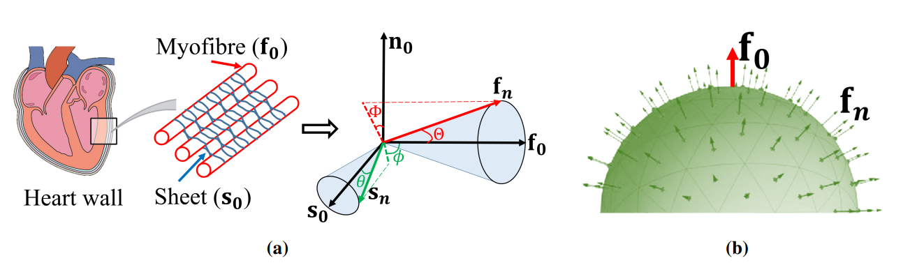

# Fibre Dispersion Myocardial Mechanics

This is the repository which accompanies the two submissions:

* Guan, D., Mei, Y., Xu, L., Cai, L., Luo, X., & Gao, H. (2022). Effects of dispersed fibres in myocardial mechanics, Part I: passive response. Mathematical Biosciences and Engineering, 19(4), 3972-3993.
* Guan, D., Wang, Y., Xu, L., Cai, L., Luo, X., & Gao, H. (2022). Effects of dispersed fibres in myocardial mechanics, Part II: active response. Mathematical Biosciences and Engineering, 19(4), 4101-4119.
Published Year: 2022

## The fibre and sheet dispersions

